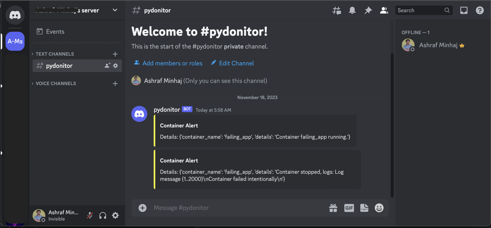

<div align="center">

# PyDoNitor


[](https://sonarcloud.io/summary/new_code?id=ashraf-minhaj_pydonitor)&nbsp;
[](https://sonarcloud.io/summary/new_code?id=ashraf-minhaj_pydonitor)&nbsp;
[](https://sonarcloud.io/summary/new_code?id=ashraf-minhaj_pydonitor)&nbsp;
&nbsp;
&nbsp;

&nbsp;
&nbsp;
&nbsp;
&nbsp;
<!-- &nbsp; -->
</div>


### Alerts on container 'state' change with crash report.

<div align="center">



Now works with discord!!
</div>

## Features
- Discord notification system with crash logs

## Future Considerations
- limit last number of logs
- Monitor multiple containers
- Slack notification

## How to use
Nothing hard, just use `ashraftheminhaj/pydonitor` in your `docker-compose.yml`. The example below runs my_app container and checks if it is healthy, otherwise catches the log -
```yml
version: '3'

name: my_app_prod

services:
  my_app:
    container_name: my_app
    build:
      context: .
      dockerfile: Dockerfile

  pydonitor:
    tty: true
    container_name: pydonitor
    image: ashraftheminhaj/pydonitor
    environment:
      - container_name=my_app
      - discord_webhook_url=https://your_discord_webhook
    depends_on:
      - my_app
    volumes:
      - /var/run/docker.sock:/var/run/docker.sock
```


### Find me 
* linkedin [ashraf-minhaj](https://www.linkedin.com/in/ashraf-minhaj)

----------

###  License
>Copyright (c) 2023 Ashrafur Rahman Minhaj
>
>Permission is hereby granted, free of charge, to any person obtaining a copy
>of this software and associated documentation files (the "Software"), to deal
>in the Software without restriction, including without limitation the rights
>to use, copy, modify, merge, publish, distribute, sublicense, and/or sell
>copies of the Software, and to permit persons to whom the Software is
>furnished to do so, subject to the following conditions:
> The above copyright notice and this permission notice shall be included in all
> copies or substantial portions of the Software.
>
> THE SOFTWARE IS PROVIDED "AS IS", WITHOUT WARRANTY OF ANY KIND, EXPRESS OR
> IMPLIED, INCLUDING BUT NOT LIMITED TO THE WARRANTIES OF MERCHANTABILITY,
> FITNESS FOR A PARTICULAR PURPOSE AND NONINFRINGEMENT. IN NO EVENT SHALL THE
> AUTHORS OR COPYRIGHT HOLDERS BE LIABLE FOR ANY CLAIM, DAMAGES OR OTHER
> LIABILITY, WHETHER IN AN ACTION OF CONTRACT, TORT OR OTHERWISE, ARISING FROM,
> OUT OF OR IN CONNECTION WITH THE SOFTWARE OR THE USE OR OTHER DEALINGS IN THE
> SOFTWARE.